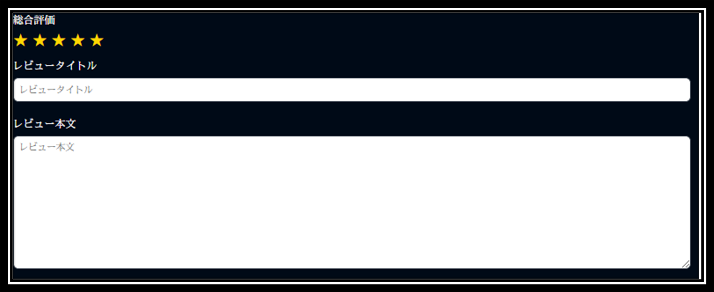

<div id="top"></div>

## 使用技術一覧

<!-- シールド一覧 -->
<!-- 該当するプロジェクトの中から任意のものを選ぶ-->
<p style="display: inline">
  


  <!-- バックエンドのフレームワーク一覧 -->
  
  <!-- ミドルウェア一覧 -->
  


</p>

## プロジェクト名
映画情報 & レビューアプリ

## 目次

1. [プロジェクトについて](#プロジェクトについて)
2. [環境](#環境)
3. [開発環境構築](#開発環境構築)


## プロジェクトについて
<br>
映画情報の検索・表示、レビューが可能なWebアプリケーションです。既存の配信サービス U-NEXTやNETFLIXでは作品を星5段階でしか評価できません。しかし、本サービスでは、5段階評価・投稿タイトル・投稿本文の3つの機能によって映画に対してのレビューを投稿することができます。これにより、作品について思いを発信したいユーザー側と、作品についてのユーザーの声を聴きたいクリエイター側の「共感・参考」といったニーズを満たすことができます。タイトルは30文字、本文は32万文字までレビューを投稿することができます。本サービスを通して、運命の映画を見つけてみませんか？

## デモ(図解)
<p align="center">
  
  
</p> 

## 環境

<!-- 言語、フレームワーク、ミドルウェア、インフラの一覧とバージョンを記載 -->

| 言語・フレームワーク・ライブラリー  | バージョン |
| --------------------- | ---------- |
| Python                | 3.13.1     |
| Javascript            | 4.2.1      |
| Html5                 | 3.14.0     |
| Css3                  | 8.0        |
| Django                | 5.1.1      |
| MySQL                 | 18.2.0     |
| Jquery                | 13.4.6     |
| TheMovieDatabase      | 1.3.6      |
|nginx| 1.27.3  |
|dictknife|0.14.1|
|django_cleanup|9.0.0|
|django_allauth|65.3.0|
|django-environ|0.11.2|
|django-cleanup|9.0.0|
|django-bootstrap-datepicker-plus|5.0.5|
|django-widget-tweaks|1.5.0|
|Pillow|11.0.0|
|Requests|2.32.3|
|mysqlclient|2.2.6|
|gunicorn|23.0.0|


## 環境構築
### Dockerで環境を構築する場合
Pythonにて以下の設定を行ってください。
## 本番環境
1.設定をする

```
.env.prod

MYSQL_ROOT_PASSWORD=root
MYSQL_DATABASE=movie-db
MYSQL_USER=movie
MYSQL_PASSWORD=movie-prod
# SECRET_KEYについては本番環境では推測されない値に変更しておきましょう
SECRET_KEY=
ALLOWED_HOSTS=localhost 127.0.0.1 [::1]
# 本番環境のためFalse
DEBUG=True
# TMDBのTOKENを下に追記する。(Bearerの後ろに半角空白入れてから追記してください。)
TMDB_TOKEN="Bearer "
```
2.環境を構築する

```
docker-compose -f docker-compose.prod.yml build
docker-compose -f docker-compose.prod.yml up -d
```

Dockerのdocker-compose.prod.ymlがある階層で上記のコマンドを入力して環境を構築する。


3.スーパーユーザーを作成
まずはコンテナの中へ入る。
```
docker exec -it コンテナ名 bash
(Linuxはbash/bin)
```
その後にmanage.pyのある階層へ移動する
```
cd src
```
そして、下記のコマンドを実行してCIに表示される指示に従ってアカウントを作成する。
(管理者用アカウントが要らない人は飛ばしてもいいです。)
```
pyhton manage.py createsuperuser
```

を入力して完成。


 ## 開発環境
1.設定をする

```
.env

MYSQL_ROOT_PASSWORD=root
MYSQL_DATABASE=movie-db
MYSQL_USER=movie
MYSQL_PASSWORD=movie
# SECRET_KEYに任意の値を入力
SECRET_KEY=
ALLOWED_HOSTS=localhost 127.0.0.1 [::1]
# 開発環境のためTrue
DEBUG=True
# TMDBのTOKENを下に追記する。(Bearerの後ろに半角空白入れてから追記してください。)
TMDB_TOKEN="Bearer "
```

2.環境を構築する

```
docker-compose -f docker-compose.yml build
docker-compose -f docker-compose.yml up -d
```

Dockerのdocker-compose.ymlがある階層で上記のコマンドを入力して環境を構築する。


3.スーパーユーザーを作成

まずはコンテナの中へ入る。
```
docker exec -it コンテナ名 bash
(Linuxはbash/bin)
```
その後にmanage.pyのある階層へ移動する
```
cd src
```
そして、下記のコマンドを実行してCIに表示される指示に従ってアカウントを作成する。
(管理者用アカウントが要らない人は飛ばしてもいいです。)
```
pyhton manage.py createsuperuser
```

を入力して完成。

<p align="right">(<a href="#top">トップへ</a>)</p>


### 仮想環境(Docker以外)で環境を構築する場合
Pythonにて

仮想環境を作成して

```
python -m venv myvenv
```
仮想環境を有効化してください。
```
myvenv\Scripts\bin\activate
```
（Linux / Mac）

```
source myvenv\bin\activate
```
（Windows）

その後
```
pip install -r requirements.txt
python manage.py pip install -r requirements.txt
python manage.py makemigrations
python manage.py migrate
python manage.py createsuperuser
python manage.py 0.0.0.0:8000
```
で実行してください。

<br>

## ディレクトリ構成
├── containers
└── src
    ├── accounts
    │ ├── __pycache__
    │ ├── migrations
    │ │ └── __pycache__
    │ └── templates
    │     └── accounts
    │         ├── inquiry
    │         ├── login
    │         ├── password
    │         ├── profile
    │         └── register
    │             └── txt
    │                 └── mail_template
    │                     └── create
    ├── app
    │ ├── __pycache__
    │ ├── migrations
    │ │ └── __pycache__
    │ ├── static
    │ │ ├── css
    │ │ ├── images
    │ │ └── js
    │ └── templates
    │     └── app
    │         ├── errors
    │         ├── movies
    │         └── review
    ├── media
    │ └── Users
    │     └── ProfileImages
    ├── mysite
    │ └── __pycache__
    └── static
        └── accounts
            └── css

38 directories

<p align="right">(<a href="#top">トップへ</a>)</p>
